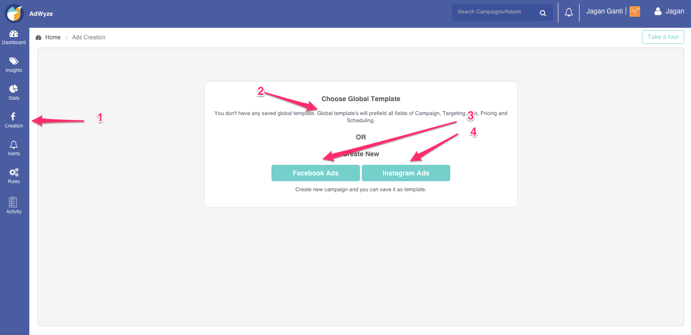

This page walks you through the campaign creation.

1. Go to Created → Ad creation
2. Choose a global template (you can save ad settings as global templates to reuse)
3. Create facebook ads
4. Create Instragram ads - You do not need to link your instagram account. The instagram accounts run from your linked facebook ad account

### What are global templates?
You campaign settings can be reused (cloned to save time) allowing you to modify only the fields that you want to change while creating a new campaign.

### How to create global templates?
At the final step of campaign creation, you can save the entire template - campaign, targeting, ads, pricing & schedule as a single global template. The next time you want to create a campaign, you can directly choose this global template from the dropdown and all the entire template loads. Proceed with necessary changes (in campaign, targeting, ad or scheduling sections) and publish. You can also save this modified template as a new global template again.

### Image Editor
AdWyze has an inbuilt Image Editor you can use to create templates and apply them while creating your ads - be it single image ads, MPA or even dynamic product ads (DPA).

Let's see how to create a template using Image Editor. It's simple to use with almost no learning curve.

- Go to creation → Image Templates
- Click on “Create Template”
- Choose from the set of base images - either from one of your recent images or from the feed. These just act as the base image for the template. When you apply a template to any product image, that product image gets replaced here in the place of the base image.
- You can add text, change font, font size & color, add border of the image, resize image or even add one more image on top of the base image.
- Image editor also supports dynamic texts that gets replaced with the actual value from the feed
e.g: You can add a text, Get product.title for product.price and while creating a DPA ad, it automagically replaces with the right product tile and price from your feed.

### Product Sets
To create new product setgs, go to **creation → product sets → choose feed → add new set**

### Custom Audience
In addition to creating templates for audience based on the targeting & split rules you have while creating a campaign, you can also create new audience set and choose this audience set while creating campaigns.

Types of custom audience currently supported
- Emails
- Phone numbers
- Advertiser ids (coming soon!)
	
To create custom audience, click on creation → custom audience.
Give a name for the audience group, choose whether these are emails or phone numbers and copy/paste the list to create new audience group. 

<!-- ### Dynamic Product Ads
 -->

### Instagram Ads
To create Instagram ads ** Go to creation → create ads → create new instagram ads **

You do not need to have any special instagram ad account to start running ads on Instagram. Once you have a facebook account linked (and have a user account in Instagram), you can directly start creating Instagram campaigns.

### How to add more ads to existing adset in a campaign?
- Go to stats → adsets
- Click on the adset in which you want to add more ads
- In the adset stats, scroll down to find “Ads” section.
- Click on “Create new ad in adset” tab. You shall be redirected to a new browser tab through which you can proceed to create your new ad. 

This ad gets saved in the adset.

### Edit campaigns
Right now, the platform doesn't allow you to edit campaigns. However, you can edit a saved template or add more ads 
into adsets of any existing campaign.

### Campaigns history
You can see the “History” of the campaigns you created. Go to **Stats → History**

