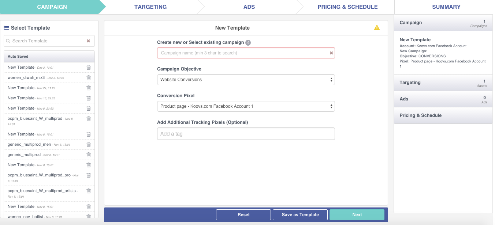
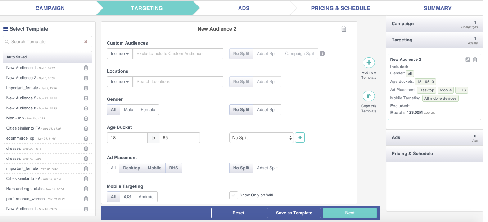
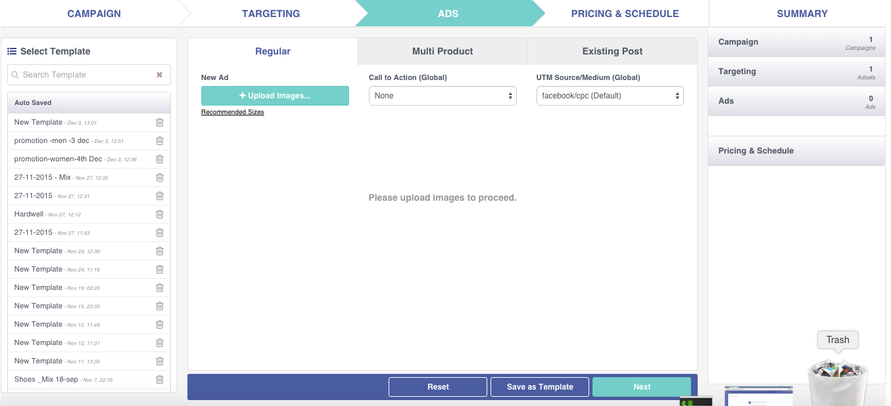
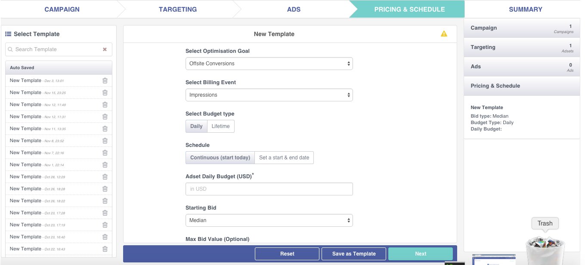
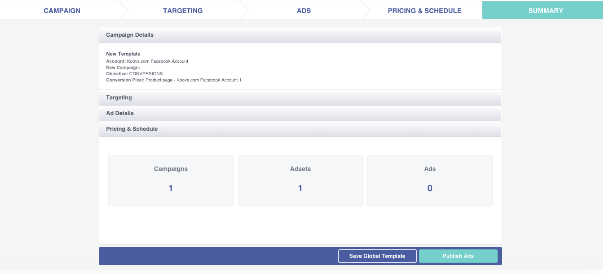

After selecting **Create FB campaign** in the ad creation page you proceed with the creation of fb campaign.

### Creating an ad campaign

The first column shows the auto saved 'campaign' templates. Please note that this column is different from the 'global template. While the global template saves the entire settings of the ad creation, this template only prefills the 'campaign' section.

### Targeting

The first column has the auto saved adsets. You can also save an adset to reuse later by clicking in the **Save as Template**.

Form Fields: This is the place you create Adsets.  You can split your audience to create different adsets (ad groups) with the same ads across all these adsets. You can create multiple adsets by choosing to split by locations, gender, age bracket and ad placement.  You can also click on “add new template” to create a new set of targeting audience besides the one you already created.

In the right most **summary** column, you can see the total adsets created for this campaign.

For e.g: If you select “Adset split” for the Gender, then there are 2 adsets created, one with Male audience and the other with Female selection for the audience.

### Create Ads

In this setup of campaign creation, you create different type of ads - regular, multi product or existing post.
Upload your creatives, choose a CTA and utm source. You can create as many ads needed. All these ads run across all the adsets within a campaign.

### Pricing & Schedule

### Summary

Review your campaign and if everything looks good, click on **Publish Ads**. You can also go back to previous steps and your campaign, targeting and ads by clicking on the header links (steps).

You can also either save all these settings as a global template or go ahead and push the campaign.
