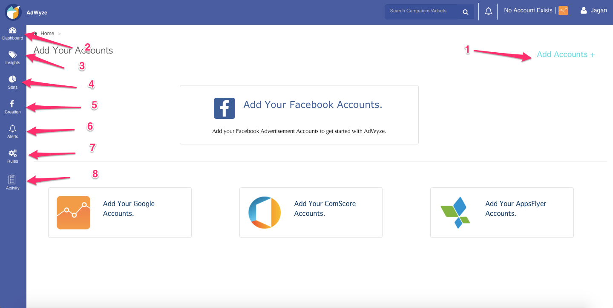
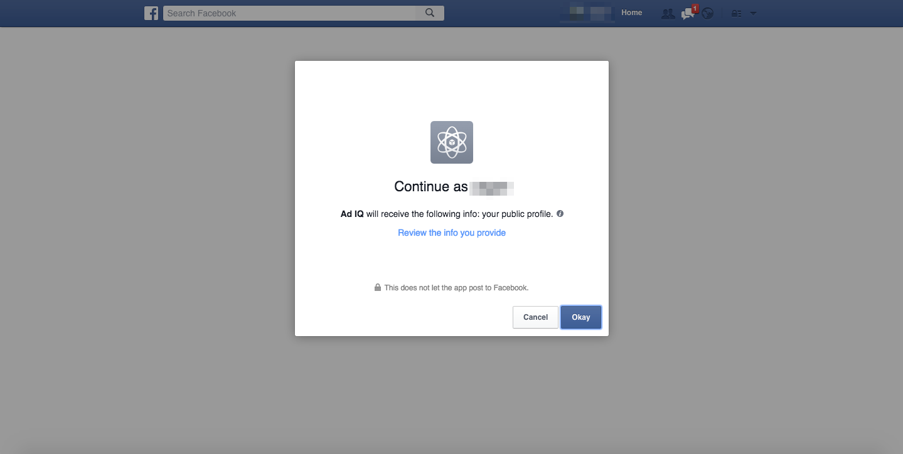
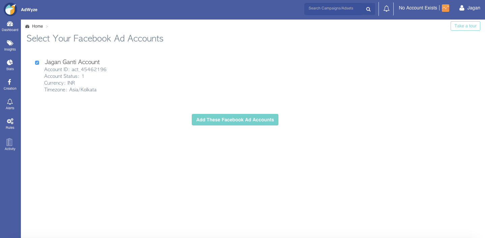
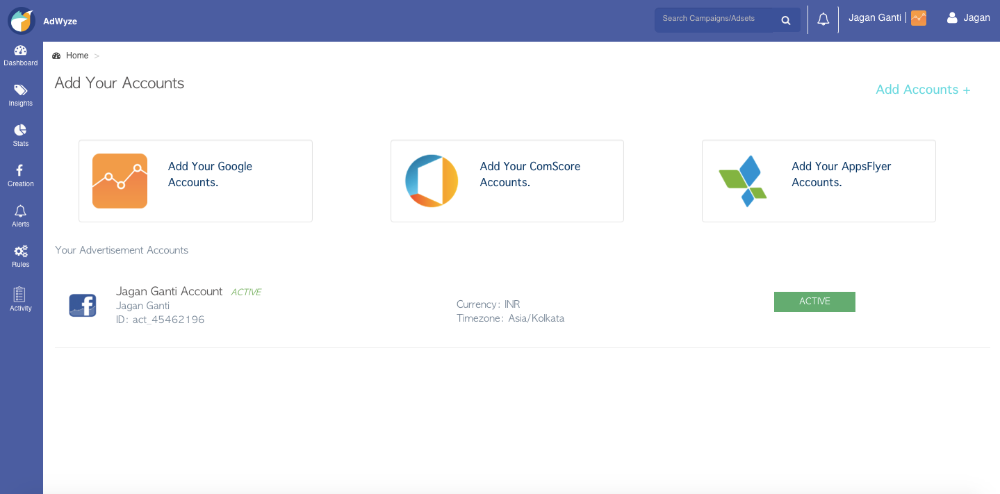

# Getting started in 2 minutes

A step by step process explaing how to get started with AdWyze

<!-- 

1. Add Accounts - Connect more of your analytic and ad platforms
2. Dashboard - Overview of all metrics and your account performance
3. Insights - Know what's working and what's not at a glance. Slice & dice data like never before
4. Stats - Shows how your campaigns are performing
5. Create - Create global templates, fb & instagram campaigns, ad sets and custom audience
6. Alerts - Get notified of crucial system and manual alerts you create
7. Rules - IFTTT (If this then that) got your campaigns, adsets and ads
8. Activity - Whole dashboard activity. Who has done what on your account
 -->

### FB account integration
If you have just signedup and logged in, you should be seeing the links to add your facebook account and analytics accounts on the home screen.
Click on the **Add you facebook accounts** link.

Give access permission and allow Ad IQ to manage your ads. Click **Okay**

After adding your facebook account, select the account and click the green button **Add These Facebook Ad Accounts**

Congrats! Your facebook ad account is successfully linked and is active. You can now start creating campaigns.
By default AdWyze uses the facebook analytics if you do not integrate any other analytics platform. 

### Analytics Integration
Now that you have integrated your facebook account, you can either integrate other analytics platforms you already use, play around with the insights or go ahead with campaign creation
