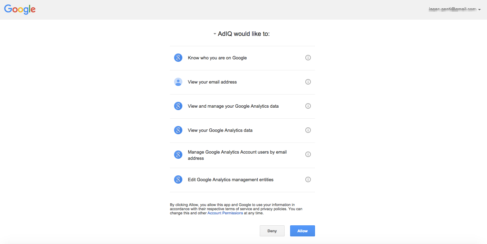
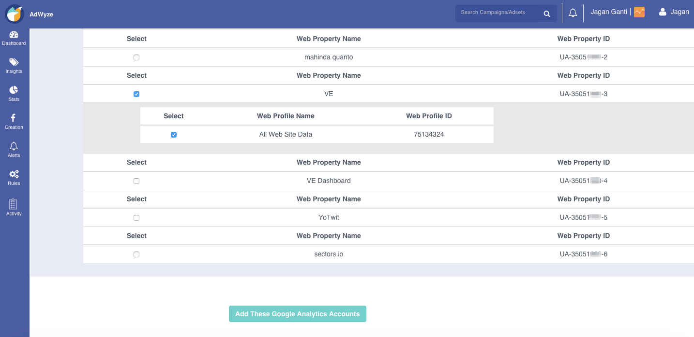

AdWyze integrated with ad platforms and analytics account. Let's see how to connect these.

### Facebook
Please refer the **Getting Started** section to connect your facebook account.

> To add multiple facebook ad accounts, click on your name on the top right corner and go to **ad accounts**.
> You can even inactivate any existing ad or analytics accounts from this section.

### GA account integration
If you do not link any of your analytics accounts, the data is pulled from your FB analytics.

**Allow **AdIQ to access your google analytics account. This will bring in your GA data to your AdWyze platform.

Select the website profile from the list pulled from your GA account and click **Add These Google Analytics Accounts**

### Commscore

[Screenshot](img/add-commScore.png)

To integrate your Commscore analytics account with AdWyze, you need to fill in the following fileds.

- Account username
- Account password
- Currency 
- Timezone
- Site
- Client
- Item ID
- Parameters source filter

Once the above info is filled and submitted, the integration happens. 

### Appsflyer

Go to add accounts -> Appsflyer to integrate your Appsflyer analytics account with AdWyze. 

[Screenshot](img/add-appsFlyer.png)

Fill the form with your android or iOS app ID, the application secret and submit it. Once these credentials are properly matched, AdWyze 
can access information from your Appsflyer account to show it in the dashboard.

### Server-to-Server (s2s)

It's now possible to integrate your custom analytics with the new server-to-server (s2s) integration. We created an api for you to send custom metrics. We also released 'show API' for you to see what data we are storing on our platform. Take a look at this [integration guide](https://platform.adwyze.com/docs/v1/index.html) to connect your analytics to AdWyze. 

[Screenshot](img/add-s2s.png)

Your app id and secret are generated. Keep them safe and use it for integrating with your custom analytics. Also, you can create custom metrics from this form.

### Twitter
Ability to run twitter ads is under development. We expect this feature to be rolled out in early 2016. If you are looking to run twitter campaigns, please contact us and we can add you to the beta list.